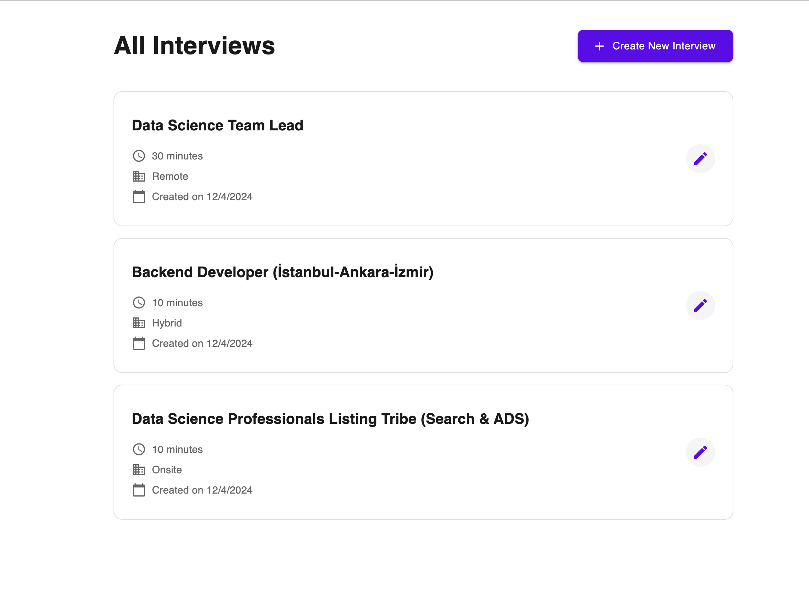

# TalentRank Interview Creation Workflow

A multi-stage interview creation workflow application built with Next.js, allowing users to create, manage, and publish interviews with customizable questions and weightage scores.

## 🚀 Live Demo

[View Live Demo](https://interview-craft-iwbt.vercel.app/)

## 📸 Screenshots

<div align="center">

  <h3>Job Listing</h3>
  
  <h3>Stage 1: Job Details</h3>
  

  <h3>Stage 2: Question Management</h3>
  

  <h3>Stage 3: Summary and Review</h3>
  
</div>

## ✨ Features

- Multi-stage interview creation workflow
- Responsive design for mobile, tablet, and desktop
- Question management with drag-and-drop functionality
- Weightage score system for questions
- Real-time data validation
- Firebase integration for data persistence
- Edit mode for existing interviews

## 🛠️ Built With

- **Framework:** [Next.js](https://nextjs.org/)
- **UI Library:** [Material-UI (MUI)](https://mui.com/)
- **State Management:** [Redux Toolkit](https://redux-toolkit.js.org/)
- **Styling:**
  - SCSS
  - CSS Modules
- **Drag and Drop:** [@dnd-kit/sortable](https://dndkit.com/)
- **Database:** [Firebase](https://firebase.google.com/)
- **Deployment:** [Vercel](https://vercel.com/)

## 📋 Interview Creation Stages

### Stage 1: Initial Interview Details
- Job Title input
- Job Description input
- Interview Duration selection
- Input validation

### Stage 2: Question Management
- Question list with mock data
- Edit and delete functionality
- Add new questions
- Drag-and-drop question reordering
- Weightage score assignment (0-3)

### Stage 3: Summary and Review
- Complete interview overview
- Section-specific edit capabilities
- Publish functionality with Firebase integration
- Update existing interviews

## 🚀 Getting Started

1. **Clone the repository**
   ```bash
   git clone https://github.com/talhatelli/interview-craft.git
   ```

2. **Install dependencies**
   ```bash
   npm install
   ```

3. **Set up environment variables**
   Create a `.env.local` file with your Firebase configuration:
   ```
   NEXT_PUBLIC_FIREBASE_API_KEY=your_api_key
   NEXT_PUBLIC_FIREBASE_AUTH_DOMAIN=your_auth_domain
   NEXT_PUBLIC_FIREBASE_PROJECT_ID=your_project_id
   NEXT_PUBLIC_FIREBASE_STORAGE_BUCKET=your_storage_bucket
   NEXT_PUBLIC_FIREBASE_MESSAGING_SENDER_ID=your_sender_id
   NEXT_PUBLIC_FIREBASE_APP_ID=your_app_id
   ```

4. **Run the development server**
   ```bash
   npm run dev
   ```

5. **Open [http://localhost:3000](http://localhost:3000) in your browser**

## 📱 Responsive Design

The application is fully responsive and optimized for:
- 📱 Mobile devices
- 📱 Tablets
- 💻 Desktop computers

## 🌐 License

This project is licensed under the MIT License - see the [LICENSE](LICENSE) file for details.

## 👤 Author

Ahmet Talha Telli
- GitHub: [@talhatelli](https://github.com/talhatelli)
- LinkedIn: [Ahmet Talha Telli](https://www.linkedin.com/in/ahmet-talha-telli/)

## 🤝 Contributing

Contributions, issues, and feature requests are welcome!

1. Fork the Project
2. Create your Feature Branch (`git checkout -b feature/AmazingFeature`)
3. Commit your Changes (`git commit -m 'Add some AmazingFeature'`)
4. Push to the Branch (`git push origin feature/AmazingFeature`)
5. Open a Pull Request
